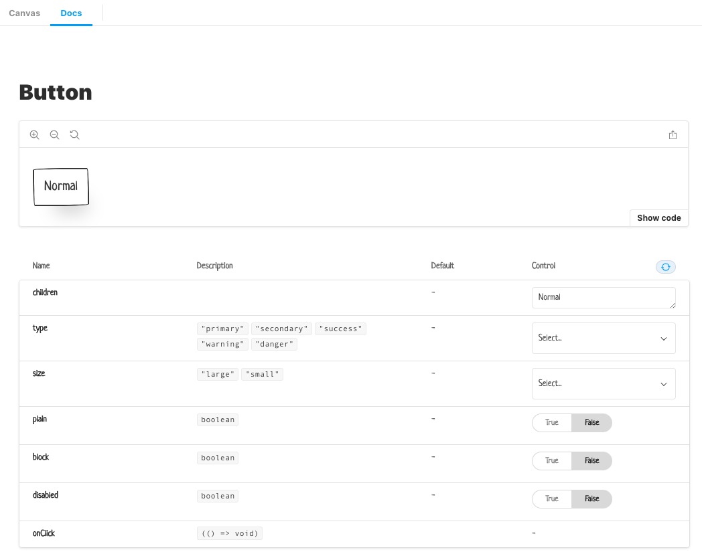

# Storybook

We will set up the `storybook` to preview and debug our first component.

Storybook `init` work with existing project, it can install dependencies and  add set some configration automatically:

```
npx sb init
```


After init running, we will install `addon-controls` and sass support: 

```
yarn add --dev @storybook/addon-controls @storybook/preset-scss sass-loader node-sass
```


Then, update the `.storybook/main.js` with:

```javascript
module.exports = {
  stories: [
    '../components/**/*.stories.mdx',
    '../components/**/*.stories.@(js|jsx|ts|tsx)'
  ],
  addons: [
    '@storybook/addon-links',
    '@storybook/addon-essentials',
    '@storybook/addon-controls',
    '@storybook/preset-scss'
  ]
}
```

and add golbal style to `.storybook/preview.js`

```javascript
import '../components/styles/index.scss'

export const parameters = {
  actions: { argTypesRegex: '^on[A-Z].*' }
}
```


After configration, we create a stories file to show up our component, just create `Button.stories.tsx` and place:

```tsx
//# components/button/Button.stories.tsx

import { Story } from '@storybook/react/types-6-0'
import React from 'react'
import { Button, ButtonProps } from './Button'

export default {
  title: 'Button',
  component: Button
}

const Template: Story<ButtonProps> = args => <Button {...args} />

export const Normal = Template.bind({})
Normal.args = { children: 'Normal' } as ButtonProps
```


Finally, run `yarn storybook`, then you will be seeing a `Button` story in the borwser like:



 

