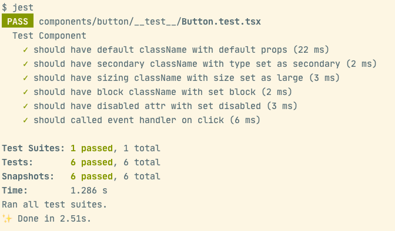

# Testing

For testing our components, we will be using Jest and React Testing Library.


Start by installing `ts-jest`:

```
yarn add --dev jest ts-jest @testing-library/react @testing-library/jest-dom @types/jest
```


And create default `jest.config.js`  using:

```
yarn ts-jest config:init
```


We will open the `jest.config.js` and check the value of `testEnvironment` equal to `jsdom` :

```
module.exports = {
  preset: 'ts-jest',
  testEnvironment: 'jsdom'
}
```


Now, we just create a testing file:

```tsx
//# components/button/__test__/Button.test.tsx

import React, { PropsWithChildren } from 'react'
import { render, fireEvent, screen } from '@testing-library/react'
import '@testing-library/jest-dom/extend-expect'

import { Button, ButtonProps } from '../Button'

describe('Test Component', () => {
  let props: PropsWithChildren<ButtonProps>

  beforeEach(() => {
    props = {
      type: 'primary',
      children: 'Button Test'
    }
  })

  const renderComponent = () => render(<Button {...props} />)

  it('should have default className with default props', () => {
    const { container } = renderComponent()
    const cmp = screen.getByText('Button Test')
    expect(cmp).toHaveClass('paper-btn')
    expect(container).toMatchSnapshot()
  })

  it('should have secondary className with type set as secondary', () => {
    props.type = 'secondary'
    const { container } = renderComponent()
    const cmp = screen.getByText('Button Test')
    expect(cmp).toHaveClass('btn-secondary')
    expect(container).toMatchSnapshot()
  })

  it('should have sizing className with size set as large', () => {
    props.size = 'large'
    const { container } = renderComponent()
    const cmp = screen.getByText('Button Test')
    expect(cmp).toHaveClass('btn-large')
    expect(container).toMatchSnapshot()
  })

  it('should have block className with set block', () => {
    props.block = true
    const { container } = renderComponent()
    const cmp = screen.getByText('Button Test')
    expect(cmp).toHaveClass('btn-block')
    expect(container).toMatchSnapshot()
  })

  it('should have disabled attr with set disabled', () => {
    props.disabled = true
    const { container } = renderComponent()
    const cmp = screen.getByText('Button Test')
    expect(cmp).toHaveAttribute('disabled')
    expect(container).toMatchSnapshot()
  })

  it('should called event handler on click', () => {
    const onClick = (props.onClick = jest.fn())
    const { container } = renderComponent()
    fireEvent.click(screen.getByText('Button Test'))
    expect(onClick).toBeCalled()
    expect(container).toMatchSnapshot()
  })
})

```


Just run `yarn jest` to start testing, you will be seeing the output like:




Finily, we will add some script in `package.json` :

```
...
"test": "jest",
"test:watch": "jest --watch",
"test:coverage": "jest --coverage",
...
```

